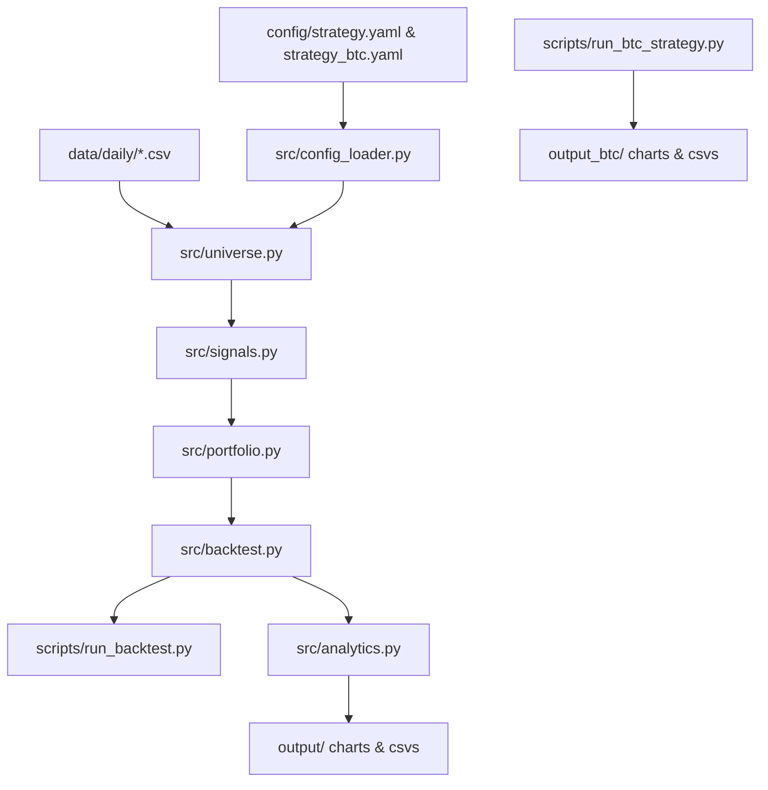

# Simulation Procedure & Repository Architecture Guide

This document provides a comprehensive guide to the **Altcoin Momentum Trading Strategy** repository. It is designed to help future developers and AI agents understand the system architecture, the backtest simulation pipeline, key design choices, and implementation details.

---

## 1. Repository Architecture

The project is structured modularly to separate configuration, ingestion, signal processing, backtesting, and analytics:



### Key Folders & Files:
*   `config/`
    *   `strategy.yaml`: Strategy hyperparameters for the cross-sectional altcoin momentum strategy.
    *   `strategy_btc.yaml`: Configuration settings (260-day SMA lookback, fees, slippage, capital) for the BTC-USDT strategy.
*   `src/`
    *   `config_loader.py`: Config parser and typed dataclasses (`AppConfig`, `StrategyConfig`).
    *   `data_ingestion.py`: Utilities to download daily historical price data from CCXT (Binance) and Yahoo Finance, handling rate-limiting and time-drift adjustments (`adjustForTimeDifference`).
    *   `universe.py`: Point-in-time asset filter. Filters assets by history length, 30-day average volume, and blacklists non-crypto assets (like index ETFs). Calculates regime filter components (BTC above 200D MA, and market breadth).
    *   `signals.py`: Computes R30 (30-day return), R7 (7-day run-up), 30-day historical standard deviation (volatility), and Volatility-Adjusted Momentum (`R30 / vol_30d`).
    *   `portfolio.py`: Filters the candidate winners (volatility checks, R7 blow-off checks). Weights them (equal-weight or volatility-parity/inverse-volatility) and computes target sizes under the risk-adjusted position limits.
    *   `backtest.py`: The core simulation loop for altcoins. Manages weekly rebalancing, target-portfolio transaction cost matching, daily intra-week stop-loss and take-profit checks, and defensive asset transitions.
    *   `analytics.py`: Calculates performance metrics (CAGR, Sharpe, Sortino, hit-rate, max drawdown, turnover) and saves comparison charts.
*   `scripts/`
    *   `download_data.py`: Downloads Binance historical daily data.
    *   `download_benchmarks.py`: Downloads stock index ETF data (`SPY`, `QQQ`).
    *   `run_backtest.py`: Entry point to execute the standard comparison backtest (Regime-filtered vs. Raw Momentum).
    *   `run_experiments.py`: Utility script to run sweep tests across different defensive assets.
    *   `run_btc_strategy.py`: Simulation runner for the BTC-USDT Weekly SMA 260 trend-following strategy, outputting metrics and charts to `output_btc/`.

---

## 2. Step-by-Step Simulation Procedure

The backtester executes the following step-by-step pipeline when running a simulation:

```
[Start Simulation]
       │
       ▼
1. Load Configuration (strategy.yaml & symbols)
       │
       ▼
2. Load Price Data (all CSVs from data/daily/)
       │
       ▼
3. Determine Rebalance Dates (weekly intervals, e.g., Sunday at 13:00 UTC)
       │
       ▼
4. Rebalance Loop (for each weekly date):
       │   
       ├── 4a. If holding period met: calculate total equity & determine targets
       │       ├── If trade_allowed (regime ok): Select top 3 momentum winners
       │       └── If regime halt: Select defensive asset (cash, BTC, QQQ, SPY)
       │
       ├── 4b. Execute sells (only close assets not in the new targets to minimize fees)
       │
       └── 4c. Execute buys (open remaining targets using available cash)
       │
       ▼
5. Daily Loop (intra-week check for each day between rebalances):
       │
       ├── Check open positions (skip checks if asset is the defensive asset):
       │   ├── If price <= stop-loss price: Close position at stop-loss (exec fee + slippage)
       │   └── If price >= take-profit price: Close position at take-profit (exec fee + slippage)
       │
       └── Mark equity curve at daily close
       │
       ▼
6. Finalize: Compute metrics (CAGR, Sharpe, DD) and plot equity/drawdown curves.
```

---

## 3. Key Design Decisions & Implementation Gotchas

Future agents should pay close attention to these architectural rules and workarounds in the codebase:

### A. Stock vs. Crypto Trading Calendars
*   Crypto trades 24/7/365, while stock ETFs (`SPY`, `QQQ`) only trade during exchange hours (excluding weekends and holidays).
*   **Solution:** In `src/universe.py`, stock weekend gaps are forward-filled using `.ffill(limit=5)` when loading the price matrix. The backtest’s price retrieval helper `_get_close()` accepts up to a 3-day gap to return the Friday close on weekends.

### B. Transaction Cost & Fee Minimization
*   Instead of blindly closing all positions every rebalancing period, the engine uses **target portfolio mapping**.
*   **Rule:** If a winner from the previous period remains a winner in the new period (or the defensive asset remains the same), the position is kept. This cuts turnover in half, drastically reducing taker fees (0.10%) and slippage (0.10%).

### C. Defensive Asset Special Rules
*   During a regime halt, the portfolio switches to the `defensive_asset`.
*   **Rule:** Stop-loss (`stop_loss_pct`) and take-profit (`take_profit_pct`) checks **must be skipped** if `pos.symbol == sc.defensive_asset`. Defensive assets are broad indices or cash and should not be closed by individual altcoin stop-loss limits.

### D. Stablecoins (USDT) as Defensive Assets
*   **Rule:** Backtesting `USDT` as a traded defensive asset is functionally equivalent to holding `cash`, but mathematically worse due to transaction costs.
*   **Explanation:** Since the portfolio's base denomination is USD/USDT, the price of USDT is always fixed at 1.0. If modeled as a traded defensive asset:
    1.  Entering/exiting it would trigger entry fees + slippage (0.20%) and exit fees + slippage (0.20%).
    2.  If modeled as cash (no trading), its returns are identical to cash (0.0%).
    3.  Therefore, using `cash` is always the optimal way to represent stablecoin defensive holds in the backtest.

---

## 4. BTC-USDT Single-Asset Trend Strategy Extension

To address the performance gap of cross-sectional altcoin momentum during bear markets, the repository includes a single-asset **BTC-USDT Tactical Allocation Strategy** using long-term trend filters.

### Strategy Rules
- **Asset Universe**: `["BTC"]` and `["USDT"]` (modeled as cash).
- **Trend Indicator**: 273-day Simple Moving Average (SMA) (determined as optimal in lookback optimization sweeps).
- **Execution Rules**:
  - Rebalance weekly on Sundays.
  - Shift signals by 1 day (`shift(1)`) so Sunday's rebalance is based on Saturday's close, preventing look-ahead bias.
  - When BTC Close > 273D SMA: Allocate 100% to BTC.
  - When BTC Close <= 273D SMA: Allocate 100% to cash.
  - Fee Model: 0.10% commission + 0.10% slippage per side (0.20% per trade).

### Commands
1. **Run Backtest**:
   ```bash
   python scripts/run_btc_strategy.py
   ```
   This writes all performance metrics, CSV trade/equity logs, and comparison charts (equity curve, drawdowns) to the `output_btc/` directory.

2. **Weekly Monitor & Dashboard**:
   ```bash
   python scripts/notify_signal.py
   ```
   This fetches live BTC prices, calculates the current signal, generates a premium responsive HTML dashboard (`output_btc/dashboard.html`), and sends a Telegram update if configured.

### Automation Workflow
The repository includes a GitHub Actions workflow in `.github/workflows/run_weekly_check.yml` that runs the monitor automatically every Sunday at 13:00 UTC, sends Telegram alerts using secrets (`TELEGRAM_TOKEN`, `TELEGRAM_CHAT_ID`), and commits the updated dashboard to the repository.


